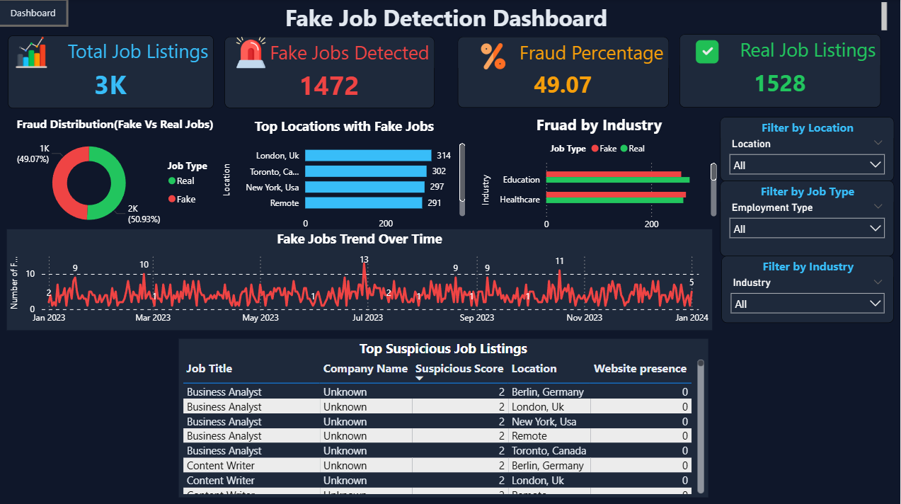
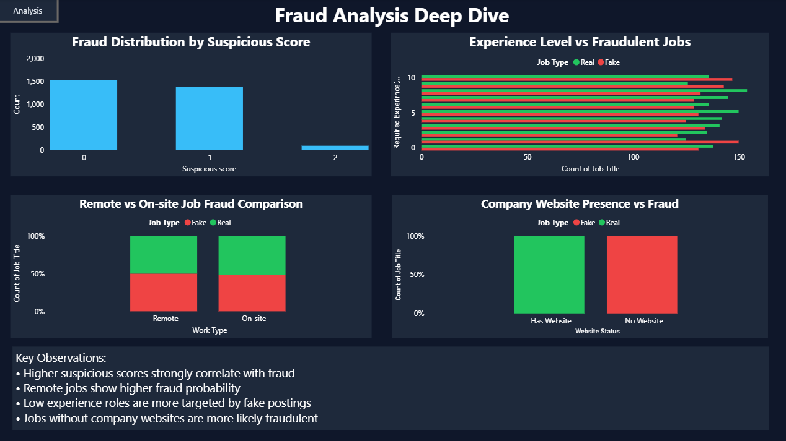
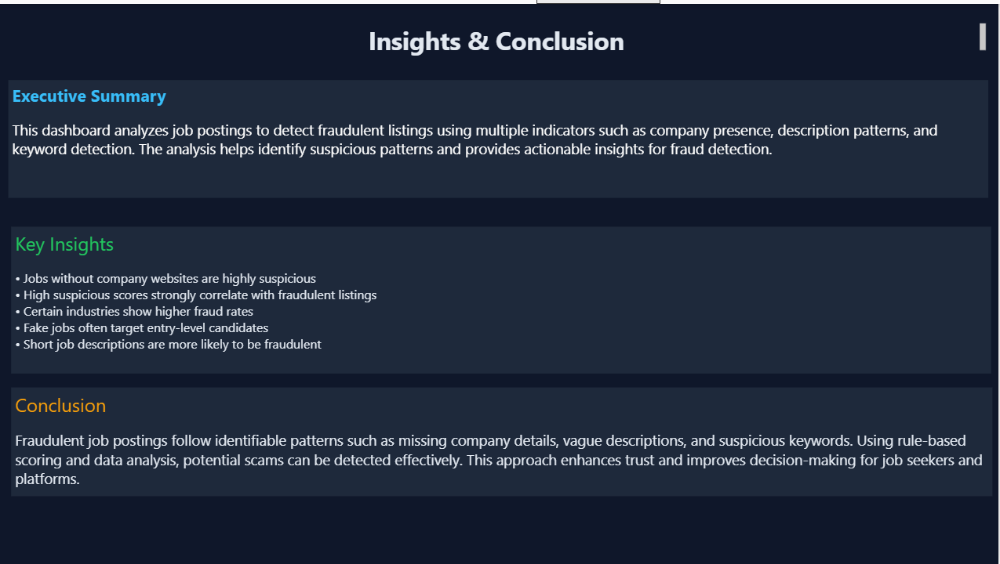

# 🚨 Fake Job Detection & Analytics Dashboard

## 📌 Overview

This project analyzes job postings to identify fraudulent listings using data cleaning, feature engineering, and interactive dashboards. It helps detect suspicious job patterns and improves decision-making.

---

## 🛠️ Tools Used

* Python (Pandas)
* SQL (MySQL)
* Power BI

---

## 📊 Key Features

* Data cleaning and preprocessing
* Feature engineering (suspicious score, keyword detection)
* SQL-based analysis queries
* Interactive Power BI dashboard with slicers and filters
* Multi-page dashboard (Overview, Analysis, Insights)

---

## 🔍 Key Insights

* Jobs without company websites are more likely to be fake
* High suspicious scores strongly indicate fraudulent listings
* Certain industries and locations show higher fraud rates
* Fake jobs often target entry-level candidates

---

## 📸 Dashboard Preview

### 📊 Main Dashboard

---

### 📈 Analysis Page

---

### 🧠 Insights Page

---

## 🚀 Conclusion

Fraudulent job postings follow identifiable patterns such as missing company details, vague descriptions, and suspicious keywords. This project demonstrates how data analysis can be used to detect and prevent such fraud effectively.

---

## 📂 Project Files

* Power BI Dashboard (.pbix)
* Cleaned Dataset
* SQL Queries
* Screenshots

---
